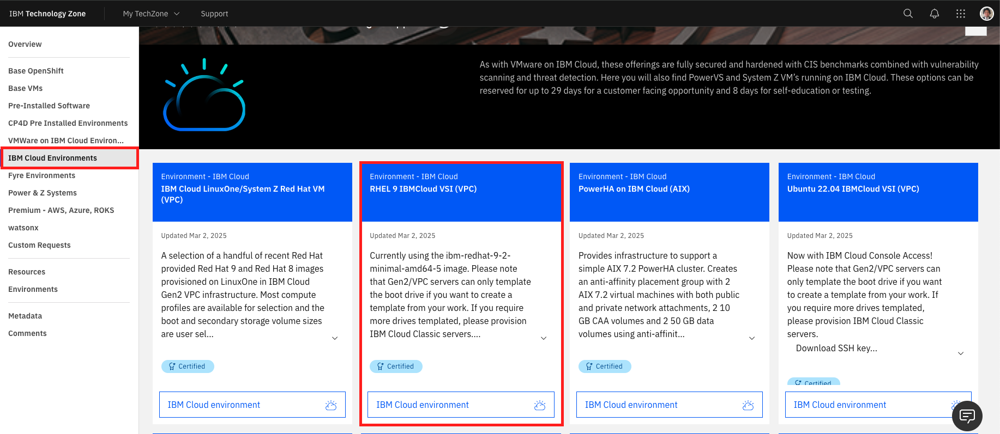
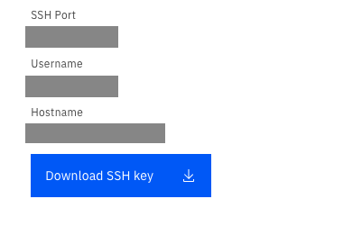
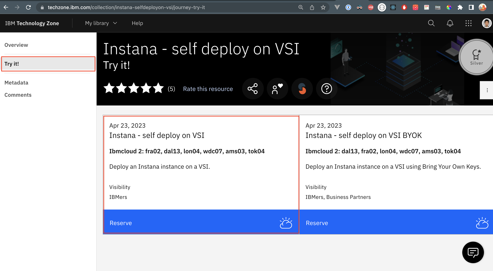
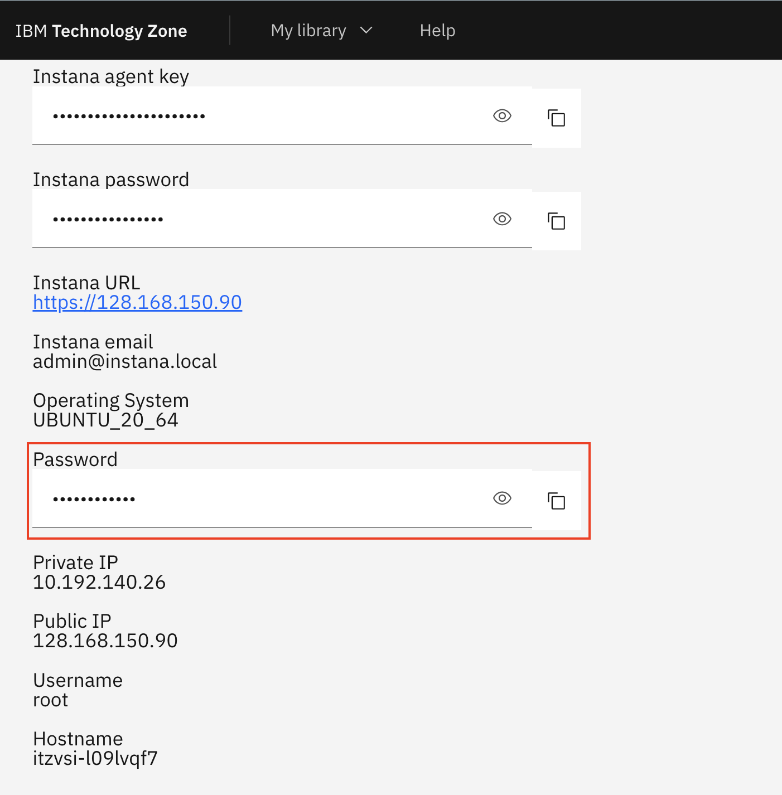
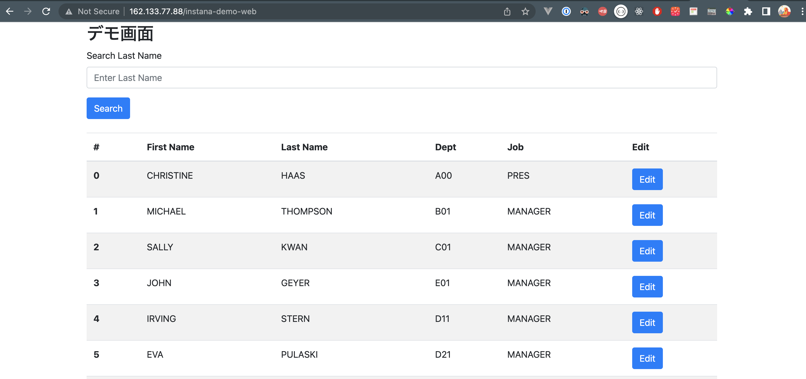
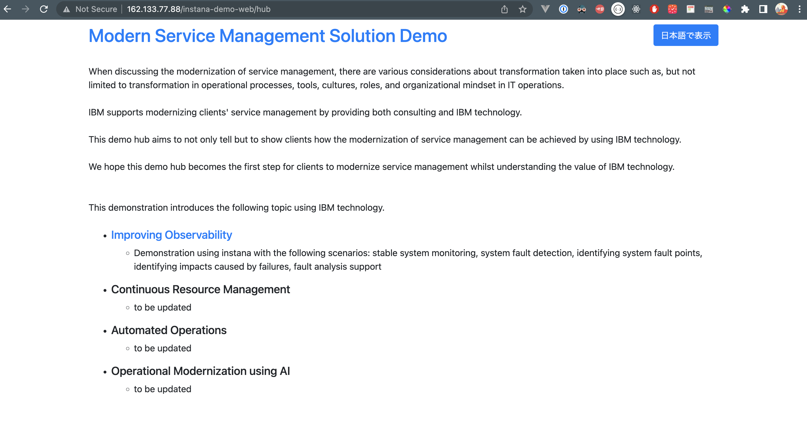
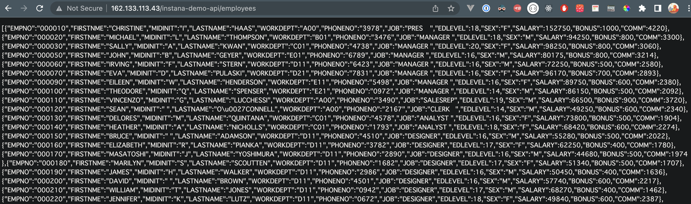

## Overview

A set of ansbile playbooks to automatically build the instana demo environment.

## Advance preparation

Install pyenv and pipenv if you need.

```sh
brew install pyenv
brew install pipenv
```

Add the following to the profile to path.

- For zsh: `~/.zshrc`
- For bash: `~/.bash_profile`

```sh
export PYENV_ROOT="$HOME/.pyenv"
export PATH="$PYENV_ROOT/bin:$PATH"
eval "$(pyenv init --path)"
```

Initialize python 

```sh
pipenv --python 3.11
```

Install vagrant. 

> [!NOTE]  
> Only required for ansible maintainer

```sh
brew insatll vagrant
```

Install virtualbox. 

> [!NOTE]  
> Only required for ansible maintainer

Download from [this site](https://www.virtualbox.org/wiki/Downloads).

Install sshpass.

```shell
brew install hudochenkov/sshpass/sshpass
```

## Set Up

Git clone.

```shell
git clone https://github.ibm.com/TechnologyGarage/ce-instana-alert-demo-ansible.git
```

Installing the python module.

```shell
pipenv install
```

Install required Ansible modules.

```shell
pipenv run ansible-galaxy collection install community.docker
```

> [!TIP]  
> If you want to run more simply for each command, you can enable the specified python environment by executing the following command.  
> If you do this, you can omit the `pipenv run` command for each command in the README.  

```shell
pipenv shell
```

## Prepare VSI

To build this environment, three `RHEL9` servers and Instana VSI are required.

The following procedure assumes that you use TechZone for prepare VSI.

1. Reserve your RHEL9 server [here](https://techzone.ibm.com/collection/tech-zone-certified-base-images/journey-ibm-cloud-environments).

   (Choose `RHEL9` for Operating System in reservation page.)

   

2. After creating VSI, download VSI private key.

   Below is a diagram created by TechZone  
   

   Rename the downloaded private key and place it under the ~/.ssh directory.

   | Server Applications | Rename |
   | -- | -- |
   | WEB01(Front app) | web01.key |
   | WEB02(Backend API) | web02.key |
   | DB | db01.key |

   Change permissions of downloaded private key to 600.

   > [!NOTE]  
   > Port 25010, which is used by the DB server, is not allowed in the security group.  
   > Please create a support ticket to request its opening.

3. Reserve Instana VSI

[here](https://techzone.ibm.com/collection/61a67d13193bdb0018e6ce89)

   

   > [!NOTE]
   > As of March 2025, this information is current.  
   > Currently, reserving this collection will result in an error.  
   > Please use the [sandbox environment](https://ibmdevsandbox-instanaibm.instana.io/#/home) instead.  

## Handling of confidential information

> [!NOTE]  
> Only required for ansible developers

Confidential information is defined in inventories/group_vars/password-encrypt.yaml and encrypted using `ansible-vault`.  
A password is required for dencrypt.

An example of how to use `ansible-vault` is shown below.

encrypt

```sh
pipenv run ansible-vault encrypt inventories/group_vars/password-encrypt.yaml
```

decrypt

```sh
pipenv run ansible-vault decrypt inventories/group_vars/password-encrypt.yaml
```

view

```sh
pipenv run ansible-vault view inventories/group_vars/password-encrypt.yaml
```

## How to create a role. \* Only required for ansible maintainer

Created using the molecule command.

```sh
cd roles
pipenv run molecule init role -d vagrant instana_demo.<ROLE_NAME>
```

Delete the tests and vars directories as they are not needed.

```sh
rm -rf <ROLE_NAME>/{tests,vars}
```

## Test Procedure.

> [!NOTE]  
> Only required for ansible maintainer  

Test using molecule.  
Create a virtual environment in your local environment using vagrant and run ansible in it.

Creating a virtual environment.(lifecycle: dependency, create, prepare)

```sh
pipenv run molecule create
```

Log in to virtual environment.

```sh
pipenv run molecule login
```

Ansible execution to virtual environment.(lifecycle: dependency, create, prepare, converge)

```sh
pipenv run molecule converge
```

Post-execution testing.(lifecycle: create, prepare, converge, idempotence, side_effect, verify)

```sh
pipenv run molecule verify
```

Destruction of virtual environment.

```sh
pipenv run molecule destroy
```

All lifecycle execution.

```sh
pipenv run molecule test
```

## Example of ansible execution.

> [!NOTE]  
> Only required for ansible maintainer  

Apply.

```sh
pipenv run ansible-playbook -i inventories/hosts <PLAYBOOK_FILE> --diff
```

Applies to password authentication.(--ask-pass option)

```sh
pipenv run ansible-playbook -i inventories/hosts <PLAYBOOK_FILE> --diff --ask-pass
```

Decrypt and apply encrypted files.(--ask-vault-pass option)

```sh
pipenv run ansible-playbook -i inventories/hosts <PLAYBOOK_FILE> --diff --ask-vault-pass
```

Dry run.(-C option)

```sh
pipenv run ansible-playbook -i inventories/hosts <PLAYBOOK_FILE> --diff -C
```

Apply by specifying host.(-l option)

```sh
pipenv run ansible-playbook -i inventories/hosts <PLAYBOOK_FILE> --diff  -l <HOST_NAME>
```

Options for avoiding SSH connection errors.(--ssh-commn-args option)

```sh
pipenv run ansible-playbook -i inventories/hosts <PLAYBOOK_FILE> --diff --ask-pass --ssh-common-args='-o StrictHostKeyChecking=no'
```

## The part to be modified when applied in the new environment.

Rewrite it with the new VM's public IP, private IP, and connection user.

- inventories/group_vars/all.yaml

```yaml
web01_public_ipaddress: "xxx.xxx.xxx.xxx"
web01_private_ipaddress: "10.xxx.xxx.xxx"
web01_ansible_user: "xxxxxxx"
web02_public_ipaddress: "xxx.xxx.xxx.xxx"
web02_private_ipaddress: "10.xxx.xxx.xxx"
web02_ansible_user: "xxxxxxx"
db01_public_ipaddress: "xxx.xxx.xxx.xxx"
db01_private_ipaddress: "10.xxx.xxx.xxx"
db01_ansible_user: "xxxxxxx"
monitor01_public_ipaddress: "xxx.xxx.xxx.xxx"
```


## Ansible Execution Procedure

### Preparation for each role

- [WAS](./roles/install_was/README.md)
- [DB2](./roles/setup_db2/README.md)
- [Instana data restore](./roles/instana_import/README.md)
- [Instana Agent](./roles/instana_agent/README.md)

### Execute Command

DB server setup

```sh
pipenv run ansible-playbook -i inventories/hosts db.yaml --ask-vault-pass --diff --ssh-common-args='-o StrictHostKeyChecking=no'
```

Web server setup

```sh
pipenv run ansible-playbook -i inventories/hosts web.yaml --ask-vault-pass --diff --ssh-common-args='-o StrictHostKeyChecking=no'
```

Instana Data Restore

```sh
pipenv run ansible-playbook -i inventories/hosts monitor_import.yaml --ask-pass --diff --ssh-common-args='-o StrictHostKeyChecking=no'
```

When you execute the command, you will be asked for the SSH password, so enter the reserved Instana VSI SSH password.



Installing the instana agent

```sh
pipenv run ansible-playbook -i inventories/hosts instana_agent.yaml --ask-vault-pass --diff --ssh-common-args='-o StrictHostKeyChecking=no' -e INSTANA_AGENT_KEY=<Instana agent key> -e HOST=<Host name or IP address of Instana> -e PORT=<Ports of instana>
```

### Execute application deploy only

Front web only

```
pipenv run ansible-playbook -i inventories/hosts web.yaml --ask-vault-pass --diff --ssh-common-args='-o StrictHostKeyChecking=no' -l web01 -t deploy
```

API only

```
pipenv run ansible-playbook -i inventories/hosts web.yaml --ask-vault-pass --diff --ssh-common-args='-o StrictHostKeyChecking=no' -l web02 -t deploy
```

Both front web and api

```
pipenv run ansible-playbook -i inventories/hosts web.yaml --ask-vault-pass --diff --ssh-common-args='-o StrictHostKeyChecking=no' -t deploy
```

### Confirm that the application has been deployed

To check if it is deployed correctly on the web server, access the following URL.

```url
http://<web01_public_ipaddress>/instana-demo-web
```



The page that causes the failure is the following URL.

```url
http://<web01_public_ipaddress>/instana-demo-web
```



To check if it is deployed correctly on the API server, access the following URL.

```url
http://<web02_public_ipaddress>/employee
```


