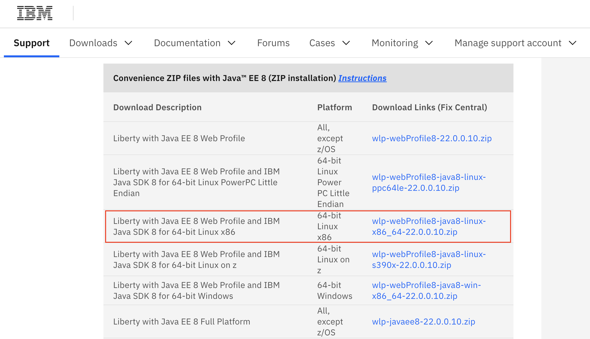

# Install WAS

Ansible role that installs Websphere Application Server

## Requirements

1. Download WAS

   Get the archived Websphere Application Server from [here](https://www.ibm.com/support/pages/220010-websphere-application-server-liberty-220010).

   File name is `wlp-webprofile8-java8-linux-x86_64-22.0.0.10.zip`

   

2. rename it to `was.zip`
3. place `was.zip` at `./roles/install_was/files` directory
